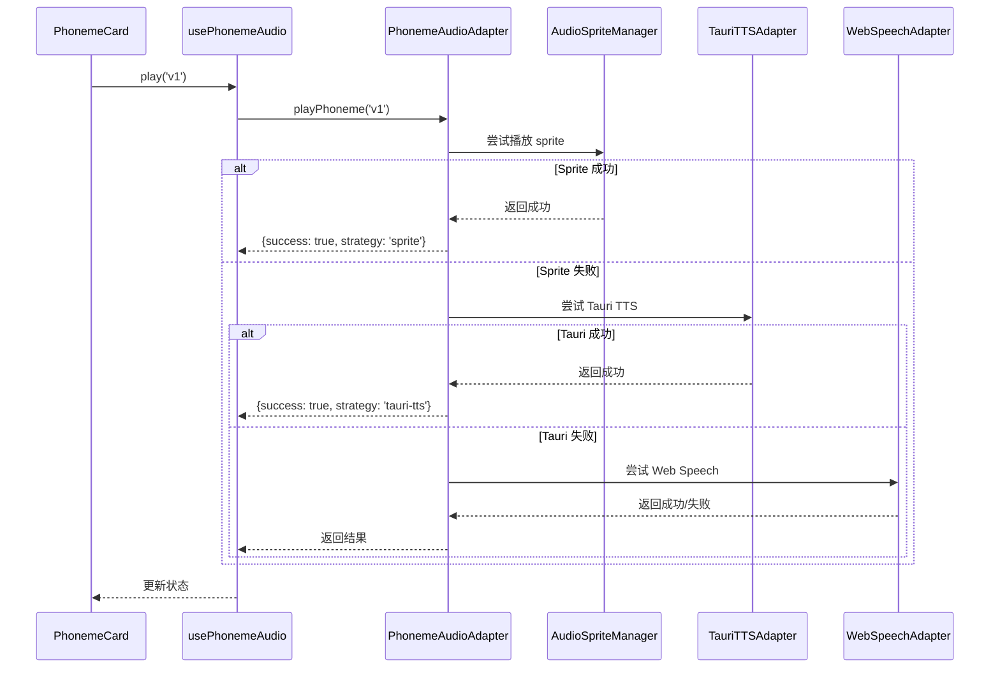

# 音频系统架构文档

## 🎯 概述

自然拼读桌面应用的音频系统采用**三层语音架构**，旨在提供稳定、一致、离线优先的音素发音体验。

## 📐 架构设计

### 三层播放策略

系统按优先级递减采用以下策略：

```
┌─────────────────────────────────────────┐
│  策略 1: 本地音频 Sprite (首选)          │
│  - Web Audio API 播放                   │
│  - 预置音频文件，一致性最好              │
│  - 支持淡入淡出，无点击声                │
│  - 延迟最低 (~10ms)                     │
└──────────────┬──────────────────────────┘
               │ 失败 ↓
┌─────────────────────────────────────────┐
│  策略 2: Tauri TTS (兜底1)              │
│  - macOS `say` 命令                     │
│  - 使用载体音节技巧 (如 "uh-th-uh")      │
│  - 需要 Tauri shell allowlist           │
│  - 延迟 ~200ms                          │
└──────────────┬──────────────────────────┘
               │ 失败 ↓
┌─────────────────────────────────────────┐
│  策略 3: Web Speech API (兜底2)         │
│  - 浏览器内置 SpeechSynthesis            │
│  - 环境差异大，但无需额外依赖             │
│  - 延迟 ~100-500ms                      │
└─────────────────────────────────────────┘
```

## 🗂️ 文件结构

```
zrpd/
├── src/
│   ├── types/
│   │   └── phoneme-audio.ts          # 音频类型定义
│   ├── utils/
│   │   └── phonemeAudioAdapter.ts    # 核心音频适配器
│   ├── hooks/
│   │   ├── usePhonemeAudio.ts        # React Hook 封装
│   │   └── useSpeech.ts              # [已废弃] 旧版简单 TTS
│   ├── data/
│   │   └── phoneme-audio-config.json # 48音素配置
│   └── components/
│       └── phoneme/
│           └── PhonemeCard.tsx       # 音标卡片（使用音频）
├── public/
│   └── assets/
│       └── audio/
│           ├── phonemes-vowels.mp3   # 元音 sprite
│           ├── phonemes-vowels.json  # 元音索引
│           ├── phonemes-consonants.mp3  # 辅音 sprite
│           └── phonemes-consonants.json # 辅音索引
├── scripts/
│   ├── generate-phonemes.sh         # 音频生成脚本
│   └── README.md                    # 脚本使用文档
└── docs/
    └── AUDIO_SYSTEM.md              # 本文档
```

## 🔧 核心模块

### 1. PhonemeAudioAdapter

**位置**: `src/utils/phonemeAudioAdapter.ts`

**职责**:
- 管理三层播放策略的执行与降级
- 加载和管理音频 sprite
- 封装 Web Audio API、Tauri TTS 和 Web Speech API

**关键方法**:

```typescript
class PhonemeAudioAdapter {
  // 初始化音频系统
  async init(): Promise<void>

  // 播放音素（自动选择策略）
  async playPhoneme(
    phonemeId: string,
    options?: PhonemePlayOptions
  ): Promise<PhonemePlayResult>

  // 预加载 sprite
  async preloadSprite(spriteKey: string): Promise<boolean>

  // 获取可用策略
  getAvailableStrategies(): PlaybackStrategy[]
}
```

### 2. usePhonemeAudio Hook

**位置**: `src/hooks/usePhonemeAudio.ts`

**用法示例**:

```tsx
import { usePhonemeAudio } from '@/hooks/usePhonemeAudio';

function PhonemeCard({ phoneme }) {
  const { play, isPlaying, lastStrategy } = usePhonemeAudio();

  const handlePlay = async () => {
    const success = await play(phoneme.id);
    console.log('播放策略:', lastStrategy);
  };

  return (
    <button onClick={handlePlay} disabled={isPlaying}>
      {isPlaying ? '播放中...' : '听发音'}
    </button>
  );
}
```

**返回值**:

```typescript
interface UsePhonemeAudioReturn {
  play: (id: string, options?) => Promise<boolean>;
  isPlaying: boolean;
  lastStrategy: PlaybackStrategy | null;
  availableStrategies: PlaybackStrategy[];
  isInitialized: boolean;
  preloadSprite: (key: string) => Promise<boolean>;
  preloadAll: () => Promise<void>;
}
```

### 3. 音素配置

**位置**: `src/data/phoneme-audio-config.json`

**格式**:

```json
{
  "metadata": {
    "version": "1.0.0",
    "totalPhonemes": 48,
    "spriteFiles": ["phonemes-vowels.mp3", "phonemes-consonants.mp3"]
  },
  "phonemes": [
    {
      "id": "v1",
      "symbol": "ɪ",
      "graphemes": ["i", "y"],
      "category": "vowel",
      "spriteKey": "phonemes-vowels",
      "region": { "start": 0, "end": 450 },
      "carrier": {
        "isolated": "ih",
        "initial": "ih",
        "medial": "uh-ih-uh",
        "final": "ih"
      },
      "ariaLabel": "短元音 i，如 bit",
      "duration": 450,
      "sampleText": "bit"
    }
  ]
}
```

## 🔄 工作流程

### 音频生成流程

1. **编辑配置**: 修改 `phoneme-audio-config.json`
2. **运行脚本**: `./scripts/generate-phonemes.sh`
3. **生成输出**:
   - 使用 eSpeak NG 合成各音素的 wav 文件
   - 使用 audiosprite 打包为 sprite (mp3 + json)
   - 输出到 `public/assets/audio/`
4. **构建验证**: `npm run build`
5. **测试播放**: 启动应用并点击"听发音"按钮

### 播放执行流程



## 🎨 载体音节技巧

当 sprite 不可用时，TTS 引擎难以单独发音单个音素。使用**载体音节**技巧：

| 音素 | IPA | 载体音节 | 说明 |
|------|-----|----------|------|
| /θ/ | θ | th-uh | 清辅音th，后接短元音 |
| /ð/ | ð | the | 浊辅音th，用单词"the" |
| /ʃ/ | ʃ | sh-uh | sh音 + 短元音 |
| /ʒ/ | ʒ | zh-uh | 视觉"vision"中的zh |
| /ŋ/ | ŋ | ng | 鼻音ng（如sing） |

### 位置变体

部分音素在不同位置发音略有不同：

```json
{
  "carrier": {
    "initial": "puh",     // 词首: pen
    "medial": "uh-puh-uh", // 词中: paper
    "final": "uh-p"       // 词尾: cap (爆破不释放)
  }
}
```

## 🧪 测试策略

### 单元测试

```typescript
// 测试适配器初始化
test('PhonemeAudioAdapter initializes correctly', async () => {
  const adapter = getPhonemeAudioAdapter();
  await adapter.init();
  const strategies = adapter.getAvailableStrategies();
  expect(strategies).toContain('sprite');
});

// 测试降级策略
test('Falls back to Web Speech when sprite fails', async () => {
  const adapter = getPhonemeAudioAdapter();
  const result = await adapter.playPhoneme('v1', {
    forceStrategy: 'web-speech'
  });
  expect(result.strategy).toBe('web-speech');
});
```

### 集成测试

1. **Sprite 播放测试**:
   - 确保 sprite 文件存在于 `public/assets/audio/`
   - 点击音标卡片，验证声音播放
   - 检查控制台日志，确认使用 `sprite` 策略

2. **TTS 兜底测试**:
   - 删除 sprite 文件（或禁用 sprite 策略）
   - 播放音素，应自动降级到 Tauri 或 Web Speech

3. **无障碍测试**:
   - 使用键盘 Tab 导航到播放按钮
   - 按 Enter 或 Space 触发播放
   - 验证 ARIA 标签正确

## 🚀 性能优化

### 1. 懒加载 Sprites

```typescript
// 应用启动时延迟预加载
useEffect(() => {
  const timer = setTimeout(() => {
    preloadPhonemeSprites();
  }, 1000); // 1秒后加载
  
  return () => clearTimeout(timer);
}, []);
```

### 2. 音频压缩

- **采样率**: 24kHz（足够语音清晰度）
- **格式**: MP3（体积小，兼容性好）
- **码率**: 默认（通常 64-128 kbps）

### 3. Sprite 分片

- 元音与辅音分开（两个 sprite 文件）
- 按需加载（如只预加载元音）

## 📊 监控指标

在生产环境中建议监控以下指标：

```typescript
interface AudioMetrics {
  totalPlays: number;          // 总播放次数
  strategyUsage: {
    sprite: number;            // Sprite 使用次数
    tauriTts: number;          // Tauri TTS 使用次数
    webSpeech: number;         // Web Speech 使用次数
  };
  averageLatency: number;      // 平均播放延迟（ms）
  failureRate: number;         // 失败率
  spriteLoadTime: number;      // Sprite 加载时间（ms）
}
```

实现示例：

```typescript
const { play, lastStrategy } = usePhonemeAudio();

const handlePlay = async (phonemeId: string) => {
  const start = performance.now();
  const success = await play(phonemeId);
  const latency = performance.now() - start;
  
  // 上报指标
  analytics.track('phoneme_play', {
    phonemeId,
    strategy: lastStrategy,
    success,
    latency,
  });
};
```

## 🛠️ 故障排查

### 问题 1: 音素不播放

**症状**: 点击"听发音"按钮无反应

**排查步骤**:
1. 打开浏览器控制台，查看错误日志
2. 检查 sprite 文件是否存在：
   ```bash
   ls -lh public/assets/audio/
   ```
3. 确认 AudioContext 权限（某些浏览器需要用户交互）
4. 测试降级策略：
   ```typescript
   play('v1', { forceStrategy: 'web-speech' });
   ```

### 问题 2: 音频有杂音/爆音

**原因**: 淡入淡出不足或音频剪辑问题

**解决**:
1. 增加淡入淡出时间（编辑脚本）:
   ```bash
   fade 0.01 0 0.01  # 从5ms增加到10ms
   ```
2. 检查原始 wav 文件是否有杂音
3. 重新生成 sprite

### 问题 3: 首次播放延迟

**原因**: Sprite 尚未加载

**解决**:
1. 在 App.tsx 中启用预加载（已实现）
2. 提前加载关键 sprite:
   ```typescript
   usePhonemeAudio({
     autoInit: true,
     preloadSprites: ['phonemes-vowels']
   });
   ```

## 🔐 安全考虑

### Tauri Shell Allowlist

如果启用 Tauri TTS，需在 `tauri.conf.json` 中配置：

```json
{
  "plugins": {
    "shell": {
      "open": false,
      "scope": [
        {
          "name": "say",
          "cmd": "/usr/bin/say",
          "args": [
            {
              "validator": "^[^;|&$<>]*$"
            }
          ]
        }
      ]
    }
  }
}
```

### 输入验证

载体音节长度限制（防止恶意输入）：

```typescript
const MAX_TEXT_LENGTH = 200;

if (text.length > MAX_TEXT_LENGTH) {
  throw new Error('Text too long');
}
```

## 📈 未来优化

1. **WebAssembly 本地合成**
   - 集成 eSpeak NG WASM 版本
   - 完全离线，无需预置文件

2. **渐进式预加载**
   - 按学习进度预加载相关音素
   - 基于使用频率动态调整

3. **音质增强**
   - 人声录制高频音素
   - 使用 AI TTS（如 OpenAI TTS）

4. **多语言支持**
   - 英式英语 vs 美式英语
   - IPA 标准音 vs 地区变体

## 📚 参考资源

- [Web Audio API 文档](https://developer.mozilla.org/docs/Web/API/Web_Audio_API)
- [eSpeak NG 仓库](https://github.com/espeak-ng/espeak-ng)
- [audiosprite 工具](https://github.com/tonistiigi/audiosprite)
- [IPA 标准](https://www.internationalphoneticassociation.org/)
- [CMU 发音词典](https://github.com/cmusphinx/cmudict)

---

**维护者**: 项目团队  
**最后更新**: 2025-10-16  
**文档版本**: 1.0.0
